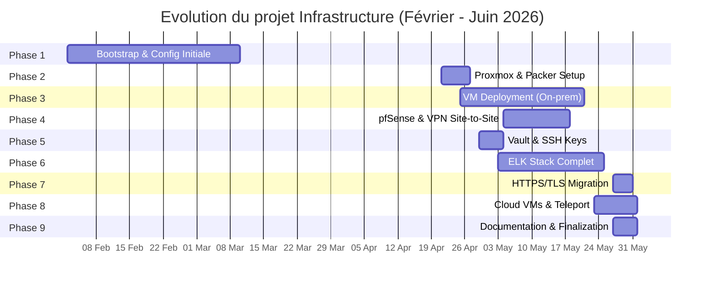

# Timeline du Projet Infrastructure

## Vue d'ensemble chronologique



## Détail des phases

### Phase 1 : Bootstrap & Configuration Initiale (Février - Mars 2026)

**Période : 02-02 au 10-03**

Mise en place de base du projet d'infrastructure

| Jalons | Date | Details |
|--------|------|---------|
| Initial setup | 02-02 | Création du repository et configuration de base |
| Documentation réseau | 10-03 | Finalisation du plan réseau |

**Commits clés :**

- Initialisation du repo
- Configuration .gitignore
- Documentation d'architecture

---

### Phase 2 : Proxmox & Packer Setup (Avril 2026)

**Période : 21-04 au 27-04**

Configuration d'un environnement de template automatisé avec Packer pour les VMs

| Jalons | Date | Details |
|--------|------|---------|
| Test Packer initial | 21-04 | Premiers tests de configuration Packer |
| Packer pfSense fonctionnel | 23-04 | Configuration complète de pfSense ISO |
| Template Ubuntu finalisé | 25-04 | Template Ubuntu-22.04 opérationnel |
| Intégration Terraform | 26-04 | Intégration Packer → Terraform |

**Commits clés :**

- `feat(pfsense): full automation of installation and network patching`
- `Update ubuntu-22.04.pkr.hcl` (multiple iterations)
- Packer build working avec cloud-init

---

### Phase 3 : VM Deployment On-Prem (Avril - Mai 2026)

**Période : 25-04 au 21-05**

Déploiement initial des VMs sur Proxmox local (PVE1)

| Jalons | Date | Details |
|--------|------|---------|
| VM provisioning avec Terraform | 25-04 | Premiers déploiements de VMs |
| pfSense sur site 1 | 26-04 | pfSense-OP déployé et connecté |
| Bug fixes réseau | 27-04 | Corrections configuration réseau |
| Configuration finalisée | 21-05 | VM provisionning stabilisé |

**Commits clés :**

- Adding ubuntu-template module
- Adding deploy vms with template on proxmox
- Corrections du DHCP et des routes

---

### Phase 4 : pfSense & VPN Site-to-Site (Mai 2026)

**Période : 04-05 au 18-05**

Configuration complète du firewall dual-site et tunnel VPN

| Jalons | Date | Details |
|--------|------|---------|
| Documentation VPN | 04-05 | Mise en place OpenVPN |
| Configuration firewall | 08-05 | Règles firewall initiales |
| Playbook pfSense | 10-05 | Ansible playbook multi-site |
| Tunnel VPN opérationnel | 17-05 | VPN site-to-site complètement configuré |
| Killswitch & DNS | 17-05 | Fonctionnalités de sécurité |
| Config finalisée | 18-05 | Configuration pfSense stable |

**Commits clés :**

- `Add OpenVPN site-to-site tunnel between pfSense-OP and pfSense-Cloud`
- `Configure pfSense firewall rules and document webGUI access`
- `Add VPN emergency kill-switch and restore playbooks`
- `Refactor pfSense playbooks: merge 3 files into single pfsense.yml with tags`

---

### Phase 5 : Vault & SSH Keys (Avril - Mai 2026)

**Période : 29-04 au 04-05**

Mise en place de la gestion des secrets et authentification SSH

| Jalons | Date | Details |
|--------|------|---------|
| SSH key generation | 29-04 | Scripts Python pour clés SSH |
| Vault déploiement initial | 29-04 | Déploiement Vault en Docker |
| Bug fixes Vault | 30-04 | Corrections connectivity |
| Playbook Vault | 02-05 | Ansible playbook Vault stable |

**Commits clés :**

- `adding script python to generate a xml config with secret from config.env`
- `deploy vault with docker`
- `Merge pull request #60 - remove-password-and-setup-ssh-key`

---

### Phase 6 : ELK Stack Complet (Mai 2026)

**Période : 03-05 au 25-05**

Déploiement de la stack de monitoring et logging (Elasticsearch, Kibana, Logstash, Filebeat)

| Jalons | Date | Details |
|--------|------|---------|
| ELK stack initial | 03-05 | Déploiement Docker ELK de base |
| Elastic Agent & Fleet | 04-05 | Configuration Fleet Server |
| Agents sur VMs | 04-05 | Déploiement Filebeat sur tous hosts |
| Netbox IPAM | 03-05 | Déploiement Netbox en Docker |
| Élimination des bugs Fleet | 17-05 | Multiples fixes enrollment agents |
| Stack ELK stable | 18-05 | Configuration Fleet server finalisée |
| Auto-sync Netbox | 25-05 | Intégration Netbox auto-sync |
| Netbox fonctionnel | 07-05 | Netbox opérationnel |

**Commits clés :**

- `adding stack elk and remove useless code`
- `adding agents ELK in vms` (elastic-agent + filebeat)
- Multiples fixes: fleet enrollment, policies, configurations
- `deployment of vault with ansible`
- `netbox is the ipam with the terraform deployment`
- `deploy netbox with docker`

---

### Phase 7 : HTTPS/TLS Migration (Mai 2026)

**Période : 27-05 au 31-05**

Migration complète vers HTTPS avec certificats TLS internes

| Jalons | Date | Details |
|--------|------|---------|
| TLS role création | 27-05 | Création rôle Ansible TLS/CA |
| HTTPS sur services | 27-05 | Déploiement certs Vault, ES, Kibana, Filebeat |
| Kibana déplacé | 27-05 | Migration Kibana vers bastion-vm |
| Gestion du disque | 27-05 | ILM Elasticsearch, rotation Docker logs |
| Documentation post-HTTPS | 27-05 | Mise à jour architecture et runbooks |
| Plan réseau SVG | 27-05 | Diagramme réseau actualisé |
| État des services | 27-05 | Documentation déploiement en cours |
| Corrections finales | 31-05 | Derniers ajustements TLS |

**Commits clés :**

- `feat: HTTPS sur tous les services (Vault, Elasticsearch, Kibana, Filebeat)`
- `feat: HTTPS complet, Kibana role, cloud VMs, ELK refactor`
- `feat: gestion disque — ILM ES, rotation logs Docker, nettoyage rôle ELK`
- `docs: mise à jour architecture, runbooks et decisions post-HTTPS`
- `docs: ajout plan réseau graphique (SVG)`
- `docs: partage règles Claude et avertissement containers déplacés`

---

### Phase 8 : Cloud VMs & Teleport (Mai - Juin 2026)

**Période : 23-05 au 01-06**

Déploiement de l'infrastructure cloud et outils d'accès sécurisé

| Jalons | Date | Details |
|--------|------|---------|
| pfSense Cloud déploiement | 23-05 | pfSense sur Cloud Proxmox (PVE2) |
| Bug fixes IP & scripts | 31-05 | Corrections configuration réseau cloud |
| 2 VMs sur cloud | 23-05 | bastion-vm et services-vm lancées |
| VM provisionning | 01-06 | Ajustements VM provisionning |
| Teleport déploiement | 01-06 | Déploiement Teleport sur bastion |

**Commits clés :**

- `deplopyement 2 vms with pfsense on cloud`
- `adding and starting 2 vms on cloud proxmox`
- `vm-provisionning adjustement`
- `adding teleport and deploy him`
- `correction des ip's et des scripts pour le deploiement`
- `Update .gitignore`

---

### Phase 9 : Documentation & Finalisation (Mai - Juin 2026)

**Période : 27-05 au 01-06**

Documentation complète et stabilisation de l'infrastructure

**Commits clés :**

- Mise à jour ARCHITECTURE.md
- RUNBOOKS.md complet
- DECISIONS.md post-HTTPS
- Règles Claude et avertissements
- Configuration Netbox finalisée
- Merge PR #72-#77

---

## Statistiques temporelles

| Métrique | Valeur |
|----------|--------|
| **Durée totale** | ~4 mois (02-02 au 01-06) |
| **Nombre de phases** | 9 phases majeures |
| **Phase la plus courte** | Vault setup (5 jours) |
| **Phase la plus longue** | ELK Stack (22 jours) |
| **Commits totaux** | 200+ commits |
| **Contributeurs** | 5 personnes |

## Dépendances entre phases

```
Bootstrap (Ph1) 
    ↓
Packer Setup (Ph2) → VM Deployment (Ph3)
                         ↓
                    pfSense (Ph4)
                         ↓
Vault (Ph5) ────────────→ ELK Stack (Ph6)
                             ↓
                        HTTPS/TLS (Ph7) → Cloud VMs (Ph8)
                             ↓
Documentation & Finalization (Ph9)
```

## Points critiques

1. **Semaine du 27-05** : Migration HTTPS + déplacement Kibana (changement architectural majeur)
2. **Semaine du 18-05** : Stabilisation pfSense + VPN opérationnel
3. **Semaine du 17-05** : Débuggage intensif Fleet/Elastic agent (22 commits/5 jours)
4. **Semaine du 26-04** : Premiers déploiements VMs (apprentissage Packer/Terraform)

## État actuel (01-06-2026)

- Infrastructure on-prem stable (Proxmox PVE1)
- Infrastructure cloud en cours (Proxmox PVE2, bastion-vm lancée)
- Stack ELK complet avec monitoring et logging
- pfSense dual-site avec VPN site-to-site
- HTTPS/TLS sur tous les services
- Vault pour gestion des secrets
- services-vm hors ligne (réseau KO)
- Teleport déployé et en test

---