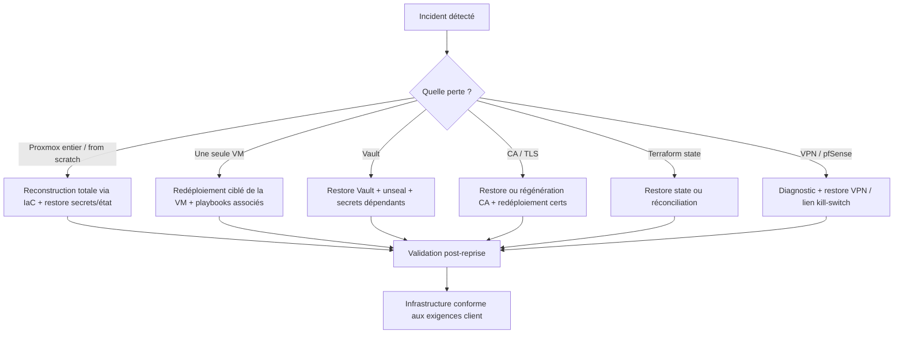

# Disaster Recovery Plan (DRP / Runbook)

Stratégie de reprise après incident pour l'infrastructure hybride DGSI Epitech (deux sites Proxmox).

> **Critère couvert :** `incident_recovery` — *« La stratégie de reprise après sinistre est utilisable et reproductible : elle spécifie les étapes pour reconstruire l'infrastructure. »*
> Ce document décrit **comment reconstruire** (automatisation + procédures), pas seulement ce qui a été fait. Il s'appuie sur l'IaC existante (Packer → Terraform → Ansible) et renvoie aux runbooks et au kill-switch déjà en place — voir [Renvois](#7-renvois).

---

## Sommaire

1. [Portée et prérequis](#1-portée-et-prérequis)
2. [Principe directeur](#2-principe-directeur)
3. [Éléments critiques à restaurer (hors repo)](#3-éléments-critiques-à-restaurer-hors-repo)
4. [Matrice scénario → procédure](#4-matrice-scénario--procédure)
5. [Procédures de reprise détaillées](#5-procédures-de-reprise-détaillées)
   - [5.1 Reconstruction totale (from scratch)](#51-reconstruction-totale-from-scratch)
   - [5.2 Perte d'une seule VM](#52-perte-dune-seule-vm)
   - [5.3 Perte / corruption de Vault](#53-perte--corruption-de-vault)
   - [5.4 Perte de la CA interne / certificats TLS](#54-perte-de-la-ca-interne--certificats-tls)
   - [5.5 Perte du Terraform state](#55-perte-du-terraform-state)
   - [5.6 Panne du VPN inter-sites / pfSense](#56-panne-du-vpn-inter-sites--pfsense)
6. [Validation post-reprise](#6-validation-post-reprise)
7. [Renvois](#7-renvois)

---

## 1. Portée et prérequis

### Périmètre couvert

| Site | Éléments |
|------|----------|
| **PVE1 — On-Premise** (`51.75.128.134`, nœud `vm3`/`proxmox-site1`) | pfSense-OP (firewall, VPN, DNS), ops-vm (Vault, Elasticsearch, Filebeat/Elastic Agent), services-vm (NetBox/IPAM) |
| **PVE2 — Cloud** (même hôte physique, bridges `vmbr3`/`vmbr4`) | pfsense-cloud-01 (firewall Cloud), bastion (Kibana, Teleport, accès externe), website (site interne) |
| **Transverse** | VPN OpenVPN site-to-site, CA interne (PKI), DNS forwarding, observabilité ELK |

### Prérequis opérateur

Avant toute opération de reprise, le poste de contrôle (controller Ansible) doit disposer de :

- Le dépôt Git de l'infrastructure cloné (`git clone <repo> && cd infra`).
- La paire de clés SSH ED25519 (`~/.ssh/id_ed25519` + `.pub`) référencée dans `config.env`.
- `config.env` rempli (copie de `config.env.example`) — voir [§3](#3-éléments-critiques-à-restaurer-hors-repo).
- `terraform/envs/onprem/terraform.tfvars` et `terraform/envs/remote/terraform.tfvars` remplis.
- Accès API + SSH root au Proxmox hôte (`root@51.75.128.134`).
- Outils installés : Terraform ≥ 1.9 (`npm run setup`), Packer ≥ 1.11, Ansible (`pip install ansible` + `ansible-galaxy install -r ansible/requirements.yml`), Node.js.
- Les tokens Proxmox injectés en variables d'environnement (voir [SECURITY.md](../../SECURITY.md)).

---

## 2. Principe directeur

L'infrastructure est **entièrement reconstructible par IaC**. Tout ce qui est versionné dans le dépôt se régénère de façon déterministe :

```
Packer (template pfSense)  →  Terraform (VMs + réseau)  →  Ansible (services)
                          npm run deploy / deploy:all              npm run ansible:*
```

La reprise repose donc sur deux familles d'éléments à traiter distinctement :

| Catégorie | Exemples | Source de reprise |
|-----------|----------|-------------------|
| **Régénéré depuis le code** | VMs, bridges réseau, règles firewall, config pfSense (`config.xml`), services Docker (Vault, ES, Kibana, NetBox), config OpenVPN, DNS forwarding, intranet/website | `git` + `npm run deploy` + playbooks Ansible |
| **Restauré depuis une sauvegarde hors-repo** | Terraform state, CA interne (`~/.ansible-tls/`), unseal keys Vault (`vault-init.json`), `config.env`, `terraform.tfvars`, clé SSH | Sauvegarde externe (voir [§3](#3-éléments-critiques-à-restaurer-hors-repo)) |

> **Hypothèse de ce DRP (restore-only) :** les sauvegardes des éléments hors-repo existent et sont accessibles. La conception du mécanisme de sauvegarde (fréquence, chiffrement, stockage) est hors périmètre de ce document. Les **données Elasticsearch ne sont pas sauvegardées** : elles sont considérées comme reconstructibles par ré-ingestion des logs via Filebeat / Elastic Agent après reprise.

---

## 3. Éléments critiques à restaurer (hors repo)

Ces éléments ne sont **jamais committés** (voir [SECURITY.md](../../SECURITY.md)). Sans eux, la reprise reste possible mais implique une **régénération** (nouveaux secrets/certs) au lieu d'une **restauration** à l'identique.

| Élément | Emplacement | Criticité | Rôle dans la reprise | Si absent |
|---------|-------------|-----------|----------------------|-----------|
| **Terraform state** | `terraform/envs/onprem/terraform.tfstate*`, `terraform/envs/remote/terraform.tfstate*` | Haute | Map les ressources Proxmox réelles aux ressources du code | Réconciliation manuelle ou redéploiement complet (voir [§5.5](#55-perte-du-terraform-state)) |
| **CA interne + certificats** | `~/.ansible-tls/` (`ca.key`, `ca.crt`, `<hostname>/`) sur le controller | Haute | Émet/valide les certs TLS de tous les services | Régénération complète de la PKI + redéploiement (voir [§5.4](#54-perte-de-la-ca-interne--certificats-tls)) |
| **Unseal keys + root token Vault** | `vault-init.json` (sur ops-vm `/root/vault-init.json`, artefact CI éphémère) | Haute | Unseal Vault, accès aux secrets KV (token Fleet, OpenVPN, etc.) | Ré-initialisation de Vault → perte des secrets stockés (voir [§5.3](#53-perte--corruption-de-vault)) |
| **`config.env`** | Racine du repo (gitignored) | Haute | Source de vérité : IPs, IDs VM, hôte/tokens Proxmox, clé SSH | À reconstituer depuis `config.env.example` + valeurs connues |
| **`terraform.tfvars`** | `terraform/envs/{onprem,remote}/` (gitignored) | Moyenne | Variables d'environnement Terraform | À reconstituer depuis les `*.tfvars.example` |
| **Clé SSH ED25519** | `~/.ssh/id_ed25519` (+ `.pub`) | Haute | Unique paire couvrant Packer, Terraform, Ansible, accès VMs | Régénérer + repropager (clé pfSense via Packer, clés VMs via redeploy) |
| **Données Elasticsearch** | ops-vm `/opt/elk/elasticsearch/data/` | Faible (jetable) | Historique des logs | Non sauvegardé — reconstruit par ré-ingestion |

---

## 4. Matrice scénario → procédure

| # | Scénario | Impact | Procédure | Outils / runbooks mobilisés |
|---|----------|--------|-----------|------------------------------|
| 1 | **Reconstruction totale** (perte complète Proxmox / from scratch) | Total — aucune VM ni service | [§5.1](#51-reconstruction-totale-from-scratch) | `npm run deploy:all` + tous les playbooks Ansible |
| 2 | **Perte d'une seule VM** (ops-vm / bastion / website / services-vm) | Partiel — service(s) de la VM | [§5.2](#52-perte-dune-seule-vm) | Terraform ciblé + playbook(s) de la VM |
| 3 | **Perte / corruption de Vault** | Secrets indisponibles (Fleet token, OpenVPN, KV) | [§5.3](#53-perte--corruption-de-vault) | `vault-init.json` + `playbooks/vault.yml` |
| 4 | **Perte CA interne / certificats TLS** | TLS cassé sur tous les services | [§5.4](#54-perte-de-la-ca-interne--certificats-tls) | `~/.ansible-tls/` + `playbooks/tls.yml` |
| 5 | **Perte du Terraform state** | Dérive état/réalité, `apply` dangereux | [§5.5](#55-perte-du-terraform-state) | Backup state ou `terraform import` |
| 6 | **Panne VPN inter-sites / pfSense** | Kibana isolé d'ES, sites déconnectés | [§5.6](#56-panne-du-vpn-inter-sites--pfsense) | `playbooks/pfsense.yml --tags restore` |

### Arbre de décision



---

## 5. Procédures de reprise détaillées

> Chaque procédure suit le format : **Déclencheur → Prérequis → Étapes → Vérification.**
> Sauf mention contraire, les commandes Ansible se lancent **depuis `ansible/`** (le `ansible.cfg` y réside) avec l'inventaire dynamique `inventory/onprem.py`.

---

### 5.1 Reconstruction totale (from scratch)

**Déclencheur :** perte complète de l'hôte Proxmox ou environnement vierge — aucune VM, aucun service.

**Prérequis :**
- Hôte Proxmox réinstallé et joignable (`ssh root@51.75.128.134 echo OK`).
- Prérequis opérateur du [§1](#1-portée-et-prérequis) réunis.
- Sauvegardes restaurées sur le controller : `config.env`, les `terraform.tfvars`, `~/.ssh/id_ed25519`, et si disponibles `~/.ansible-tls/` et `vault-init.json`.

**Étapes :**

1. **Préparer le controller**
   ```bash
   git clone <repo> && cd infra
   npm run setup                                   # installe Terraform
   ssh-add ~/.ssh/id_ed25519
   ssh-copy-id -i ~/.ssh/id_ed25519.pub root@51.75.128.134
   ansible-galaxy install -r ansible/requirements.yml
   ```

2. **Restaurer la configuration** (depuis sauvegarde, sinon recopier les `*.example` et remplir)
   ```bash
   cp config.env.example config.env                # puis remplir
   cp terraform/envs/onprem/terraform.tfvars.example terraform/envs/onprem/terraform.tfvars
   cp terraform/envs/remote/terraform.tfvars.example terraform/envs/remote/terraform.tfvars
   ```

3. **Restaurer les secrets/état hors-repo s'ils existent** (sinon ils seront régénérés)
   - `~/.ansible-tls/` → réutilise la CA existante (sinon `playbooks/tls.yml` en régénère une — voir [§5.4](#54-perte-de-la-ca-interne--certificats-tls)).
   - `vault-init.json` → permet l'unseal automatique (sinon ré-init — voir [§5.3](#53-perte--corruption-de-vault)).
   - Terraform state → si absent, un `apply` recrée tout depuis zéro (voir [§5.5](#55-perte-du-terraform-state)).

4. **Déployer l'infrastructure des deux sites** (Packer template pfSense + Terraform VMs + réseau)
   ```bash
   npm run deploy:all        # PVE1 (deploy.sh) + PVE2 (deploy-remote.sh) en parallèle
   # logs : logs/deploy-onprem.log et logs/deploy-remote.log
   ```
   > Pour un site à la fois : `npm run deploy` (onprem) puis `npm run deploy:remote` (cloud).

5. **Configurer les services dans l'ordre** (depuis `ansible/`)
   ```bash
   cd ansible
   ansible-playbook playbooks/tls.yml            # 1. CA interne + certs (avant tout)
   ansible-playbook playbooks/vault.yml          # 2. Vault (init/unseal)
   ansible-playbook playbooks/elk.yml            # 3. Elasticsearch (ops-vm)
   ansible-playbook playbooks/kibana.yml         # 4. Kibana (bastion)
   ansible-playbook playbooks/filebeat.yml       # 5. Filebeat → ES
   ansible-playbook playbooks/pfsense.yml --tags configure   # 6. Firewall, VPN, DNS
   ```
   Services complémentaires : `teleport.yml` (bastion SSH centralisé), `netbox-register.yml` / `netbox-sync-deploy.yml` (IPAM), `services-vm.yml`, `pfsense-cloud.yml`.

6. **Vérifier** → exécuter la [checklist du §6](#6-validation-post-reprise).

---

### 5.2 Perte d'une seule VM

**Déclencheur :** une VM est détruite ou corrompue, les autres restent saines.

**Prérequis :** Terraform state cohérent (sinon [§5.5](#55-perte-du-terraform-state)) ; CA et Vault opérationnels.

**Étapes communes :**

1. Identifier la VM et son environnement Terraform (`onprem` ou `remote`).
2. Recréer **uniquement** la VM ciblée :
   ```bash
   # Exemple ops-vm (module ops_vm dans l'env onprem)
   terraform -chdir=terraform/envs/onprem apply -target=module.ops_vm
   ```
   > Alternative complète : relancer `npm run deploy` (onprem) ou `npm run deploy:remote` (cloud) — idempotent, ne recrée que ce qui manque.
3. Rejouer le(s) playbook(s) de la VM (voir tableau ci-dessous).
4. Vérifier le service concerné.

**Cas particuliers par VM :**

| VM | Env | Services hébergés | Playbooks à rejouer | Dépendances |
|----|-----|-------------------|---------------------|-------------|
| **ops-vm** (`172.16.0.253`) | onprem | Vault, Elasticsearch, Filebeat/Elastic Agent | `tls.yml` → `vault.yml` → `elk.yml` → `filebeat.yml` | Vault et ES réémis ; Kibana (bastion) se reconnecte via VPN. Données ES reconstruites par ré-ingestion |
| **bastion** (`10.255.255.249`) | remote | Kibana, Teleport, Filebeat | `tls.yml` → `kibana.yml` → `teleport.yml` → `filebeat.yml` | Dépend du VPN actif pour joindre ES sur ops-vm |
| **website** (`192.168.255.243`) | remote | Site web interne (intranet) | `services-vm.yml` (rôle `intranet`) | Pas de Docker ; accessible uniquement via LAN cloud |
| **services-vm** (`172.16.0.241`) | onprem | NetBox (IPAM) | `netbox-register.yml`, `netbox-sync-deploy.yml` | ⚠️ historiquement hors ligne — vérifier l'état avant |

**Vérification :** la VM répond au `ping` Ansible et son service expose son endpoint (voir [§6](#6-validation-post-reprise)).
```bash
ansible all -m ping        # depuis ansible/
```

---

### 5.3 Perte / corruption de Vault

**Déclencheur :** Vault inaccessible, container détruit, données `/opt/vault/data` corrompues, ou unseal impossible.

**Prérequis :** déterminer si `vault-init.json` (unseal keys + root token) est disponible.

#### Cas A — `vault-init.json` disponible (restauration à l'identique)

1. Redéployer Vault (recrée le container, monte les volumes, **unseal automatiquement** depuis `vault-init.json`) :
   ```bash
   cd ansible
   ansible-playbook playbooks/vault.yml
   ```
   Le rôle `vault` détecte l'état `sealed` et applique les 3 clés d'unseal automatiquement.

2. Vérifier l'état :
   ```bash
   # tunnel SSH ouvert vers ops-vm (voir RUNBOOKS §2)
   curl -sk --cacert ~/.ansible-tls/ca.crt https://localhost:8200/v1/sys/health | python3 -m json.tool
   # attendu : "initialized": true, "sealed": false
   ```

#### Cas B — `vault-init.json` perdu (ré-initialisation, perte des secrets KV)

> ⚠️ Sans les unseal keys, les données Vault existantes sont **irrécupérables**. Vault doit être ré-initialisé, ce qui régénère un nouveau jeu de secrets.

1. Repartir d'un volume Vault vide puis ré-initialiser via le playbook (génère un nouveau `vault-init.json`) :
   ```bash
   cd ansible
   ansible-playbook playbooks/vault.yml
   ```
2. **Sauvegarder immédiatement** le nouveau `/root/vault-init.json` hors de la VM.
3. **Repeupler les secrets dépendants** (impact en cascade) :
   - **Token Fleet/Elastic Agent** (`secret/data/elk/fleet-enrollment-token`) → régénéré par `elk.yml` puis `elastic-agent.yml`.
   - **Token Teleport** (`secret/data/teleport/join-token`) → régénéré par `teleport.yml`.
   - **Secrets OpenVPN** → réémis si gérés via Vault (sinon dans `vars/openvpn_secrets.yml`).
   ```bash
   ansible-playbook playbooks/elk.yml
   ansible-playbook playbooks/elastic-agent.yml
   ansible-playbook playbooks/teleport.yml
   ```

**Vérification :** `"sealed": false` et lecture d'un secret KV de test réussie.

---

### 5.4 Perte de la CA interne / certificats TLS

**Déclencheur :** `~/.ansible-tls/` perdu/corrompu, ou certificats expirés → erreurs TLS sur Vault, ES, Kibana, Filebeat.

#### Cas A — `~/.ansible-tls/` disponible (restauration)

1. Restaurer le répertoire sur le controller (`ca.key`, `ca.crt`, `<hostname>/`).
2. Redéployer les certs sur les hôtes :
   ```bash
   cd ansible
   ansible-playbook playbooks/tls.yml      # cible ops:bastion
   ```

#### Cas B — CA perdue (régénération complète)

> La régénération crée une **nouvelle CA**. Tous les certs doivent être réémis et redéployés, et le `ca.crt` réimporté dans les navigateurs/clients.

1. Régénérer CA + certs et les déployer (`/etc/ssl/internal/` sur chaque VM) :
   ```bash
   cd ansible
   ansible-playbook playbooks/tls.yml
   ```
2. Redémarrer les services qui consomment les certs (pour recharger les nouveaux) :
   ```bash
   ansible ops -m shell -a "docker compose -f /opt/elk/docker-compose.yml restart elasticsearch" --become
   ansible bastion -m shell -a "docker compose -f /opt/kibana/docker-compose.yml restart kibana" --become
   ansible ops:bastion -m shell -a "systemctl restart filebeat"
   ansible-playbook playbooks/vault.yml      # recharge le listener TLS + unseal
   ```
3. Réimporter `~/.ansible-tls/ca.crt` dans les navigateurs utilisés pour accéder à Kibana/Vault/ES.

**Vérification :** appels HTTPS avec `--cacert ~/.ansible-tls/ca.crt` sans erreur de certificat (voir [§6](#6-validation-post-reprise)).

---

### 5.5 Perte du Terraform state

**Déclencheur :** `terraform.tfstate` perdu/corrompu → Terraform ne connaît plus les ressources existantes.

#### Cas A — Backup du state disponible

1. Restaurer `terraform.tfstate` (+ `.backup`) dans `terraform/envs/onprem/` et/ou `terraform/envs/remote/`.
2. Vérifier la cohérence état/réalité :
   ```bash
   npm run tf:plan:onprem        # doit afficher « No changes » si cohérent
   terraform -chdir=terraform/envs/remote plan
   ```

#### Cas B — State irrécupérable, infrastructure encore présente

> Ne **jamais** lancer `apply` sans state : Terraform tenterait de recréer des ressources existantes (conflits d'IDs VM, doublons).

1. Réimporter les ressources existantes dans un state neuf via `terraform import` (VMs par VMID, bridges, etc.), en s'appuyant sur les IDs documentés dans `config.env` / [ARCHITECTURE.md](../architecture/ARCHITECTURE.md). Exemple :
   ```bash
   terraform -chdir=terraform/envs/onprem import 'module.ops_vm.proxmox_virtual_environment_vm.this' proxmox-site1/2038
   ```
2. Valider avec `terraform plan` jusqu'à obtenir « No changes ».

#### Cas C — State irrécupérable, infrastructure perdue

→ Traiter comme une [reconstruction totale (§5.1)](#51-reconstruction-totale-from-scratch) : un `apply` sur state vide recrée tout.

**Vérification :** `terraform plan` propre (aucun changement non désiré) sur les deux environnements.

---

### 5.6 Panne du VPN inter-sites / pfSense

**Déclencheur :** tunnel OpenVPN down → Kibana (bastion) ne joint plus Elasticsearch (ops-vm) ; sites déconnectés. Peut aussi résulter d'un **kill-switch** activé volontairement (voir critère `incident_killswitch`).

**Prérequis :** pfSense joignable en SSH.

**Étapes :**

1. **Diagnostic de joignabilité pfSense :**
   ```bash
   ssh admin@5.196.45.8 echo "pfSense-OP OK"
   ssh admin@5.196.50.52 echo "pfSense-Cloud OK"
   ```

2. **Si le kill-switch a été activé** (coupure d'urgence volontaire), rétablir le VPN — le tag `restore` supprime la règle KILLSWITCH et recrée le client OpenVPN :
   ```bash
   cd ansible
   ansible-playbook playbooks/pfsense.yml --tags restore
   # côté cloud si nécessaire :
   ansible-playbook playbooks/pfsense-cloud.yml --tags restore
   ```

3. **Si la config pfSense est perdue/incohérente**, réappliquer la configuration complète (firewall, OpenVPN, DNS forwarding) :
   ```bash
   ansible-playbook playbooks/pfsense.yml --tags configure
   ansible-playbook playbooks/pfsense-cloud.yml
   ```
   > Si pfSense lui-même est détruit, le rebuild passe par Packer (template pfSense) + Terraform — voir [§5.1](#51-reconstruction-totale-from-scratch). La clé SSH admin et `config.xml` sont réinjectés par le build Packer.

4. **Vérification du tunnel et des flux :**
   ```bash
   # depuis le bastion, vérifier l'accès à ES via le tunnel VPN
   ansible bastion -m shell -a "docker logs kibana --tail 20" --become
   ```
   Kibana doit cesser d'afficher « Kibana server is not ready yet » une fois ES joignable.

> Détails opérationnels du kill-switch / restore : voir [RUNBOOKS.md](RUNBOOKS.md) et l'en-tête de `ansible/playbooks/pfsense.yml`.

---

## 6. Validation post-reprise

Après toute reprise, vérifier que **chaque exigence client** est de nouveau remplie :

| # | Exigence | Contrôle | Attendu |
|---|----------|----------|---------|
| 1 | Site on-prem accessible uniquement en interne | Tentative d'accès direct externe aux VMs PVE1 | Refusé (réseaux privés derrière pfSense-OP) |
| 2 | Site distant accessible en externe via bastion | Accès Teleport/SSH au bastion depuis internet | OK via `51.75.128.134:3080` / ProxyJump |
| 3 | VPN site-to-site actif | Kibana (bastion) joint ES (ops-vm) | Logs Kibana « ready », pas d'erreur ES |
| 4 | Firewalls effectifs (séparation de trafic) | `ssh admin@5.196.45.8` / `admin@5.196.50.52` ; règles présentes | SSH OK, règles appliquées |
| 5 | DNS forwarding entre sites | Résolution croisée des zones internes | Réponses correctes |
| 6 | IPAM (NetBox) à jour | NetBox accessible et synchronisé | Préfixes/devices présents |
| 7 | Observabilité (logs centralisés) | `_cat/indices` Filebeat sur ES | `docs.count` > 0 |
| 8 | Website accessible en interne uniquement | Accès depuis LAN cloud vs externe | OK en interne, refusé en externe |
| 9 | Vault opérationnel | `sys/health` | `initialized: true`, `sealed: false` |
| 10 | TLS sur tous les services | Appels HTTPS avec `--cacert ca.crt` | Aucun avertissement de certificat |

Commandes de vérification observabilité / Vault :
```bash
# Indices Filebeat (tunnel ES ouvert)
curl -sk --cacert ~/.ansible-tls/ca.crt -u elastic:<password> \
  "https://localhost:9200/_cat/indices?v&h=index,docs.count,store.size"

# Santé Vault (tunnel Vault ouvert)
curl -sk --cacert ~/.ansible-tls/ca.crt https://localhost:8200/v1/sys/health | python3 -m json.tool

# Ping global Ansible (depuis ansible/)
ansible all -m ping
```

> Détails des tunnels SSH, URLs et credentials : [RUNBOOKS.md §2](RUNBOOKS.md#2-accéder-aux-services-via-tunnel-ssh).

---

## 7. Renvois

| Sujet | Référence |
|-------|-----------|
| Procédures opérationnelles courantes (déploiement, tunnels, Vault, ELK, disque, diagnostics) | [docs/runbooks/RUNBOOKS.md](RUNBOOKS.md) |
| Architecture, IPs, VMIDs, flux, ordre de déploiement | [docs/architecture/ARCHITECTURE.md](../architecture/ARCHITECTURE.md) |
| Décisions techniques (SSH key-only, DHCP, PKI interne, ELK, Teleport, bridges Cloud) | [docs/decisions/DECISIONS.md](../decisions/DECISIONS.md) |
| Kill-switch / coupure d'urgence (`incident_killswitch`) | `ansible/playbooks/pfsense.yml --tags killswitch` / `--tags restore` |
| Gestion des secrets, tokens Proxmox, unseal keys | [SECURITY.md](../../SECURITY.md) |
| Démarrage rapide, prérequis, structure du projet | [README.md](../../README.md) |
| Phases du projet (Gantt) | [docs/PROJECT_TIMELINE.md](../PROJECT_TIMELINE.md) |
